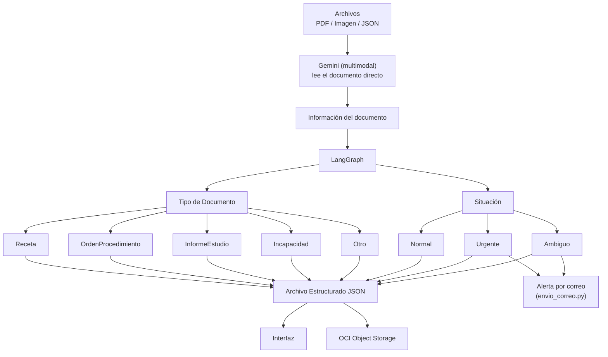

# Arquitectura — MediFlow

## Diagrama

## Componentes
 
| Componente | Función | Tecnología |
|---|---|---|
| Ingesta | Recibe el archivo (PDF, imagen o JSON) | ingesta_archivos.py |
| Extracción | Lee el documento directo (multimodal) y devuelve la información estructurada | Gemini |
| Orquestación | Clasifica por dos dimensiones y decide el enrutamiento | LangGraph |
| Notificación | Alerta por correo en casos Urgente/Ambiguo | `envio_correo.py` (smtplib + Gmail) |
| Almacenamiento | Guarda los archivos | ingesta_archivos.py y OCI Object Storage |
| Persistencia | Guarda el JSON final | OCI Object Storage |
| Interfaz | Muestra el resultado / panel HITL | Por definir (Streamlit/FastAPI) |
 
## Las dos dimensiones de clasificación
 
- **Tipo de Documento**: `Receta` / `OrdenProcedimiento` / `InformeEstudio` / `Incapacidad` / `Otro`
- **Situación**: `Normal` / `Urgente` / `Ambiguo`
Un documento queda descrito por la combinación de ambas — por ejemplo, una Receta en situación Normal se enruta distinto a un InformeEstudio en situación Urgente.

